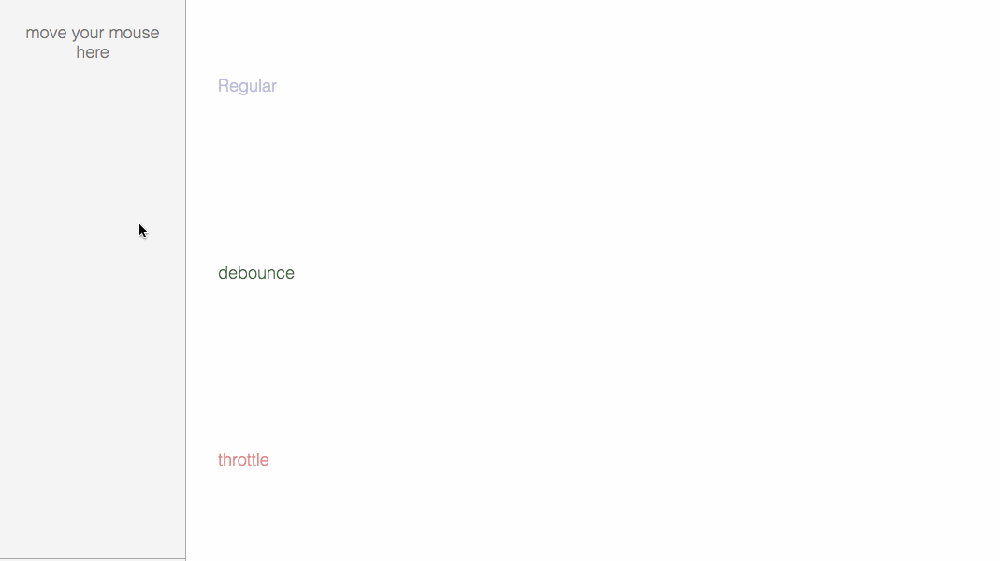

<!--
 * @Descripttion: 
 * @version: 1.0.0
 * @Author: jimmiezhou
 * @Date: 2019-12-13 22:11:15
 * @LastEditors: jimmiezhou
 * @LastEditTime: 2019-12-14 11:44:16
 -->
# 原理

节流（throttle）:不管事件触发频率多高，只在单位时间内执行一次。



# 应用场景

## 窗口大小变化，调整样式

```javascript
window.addEventListener('resize', debounce(handleResize, 200));
```

## 搜索框，输入后1000毫秒搜索

```javascript
debounce(fetchSelectData, 300);
```

## 表单验证，输入1000毫秒后验证

```javascript
debounce(validator, 1000);
```

# 实现

有两种方式可以实现节流，使用时间戳和定时器。

## 时间戳实现

> 第一次事件不会触发，最后一次一定触发

```javascript
function throttle(fn, interval) {
    let last = 0
    return function (...args) {
        let now = +(new Date())
        if (now - last > interval) {
            fn.apply(this, args)
            last = now
        }
    }
}
```

## 定时器实现

>第一次事件不会触发，最后一次一定触发

```javascript
function throttle(fn, delay) {
    let timmer = null
    return function (...args) {
        if (!timmer) {
            timmer = setTimeout(() => {
                timmer = null
                fn.apply(this, args)
            }, delay);
        }
    }
}
```

## 结合版

>定时器和时间戳的结合版，也相当于节流和防抖的结合版，第一次和最后一次都会触发

```javascript
function throttle(fn, delay) {
    let timmer = null
    let last = 0
    return function (...args) {
        let now = +(new Date)
        if (now - last > delay) {
            clearTimeout(timmer)
            timmer = null
            last = now
            fn.apply(this, args)
        } else if (!timmer) {
            timmer = clearTimeout(() => {
                fn.apply(this, args)
            }, delay)
        }
    }
}
```