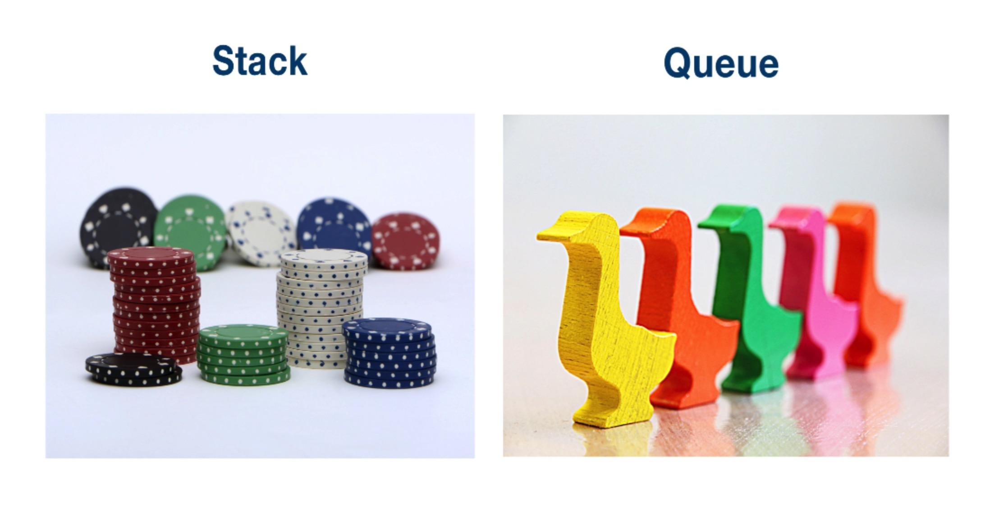

<!--
 * @Descripttion: 
 * @version: 1.0.0
 * @Author: jimmiezhou
 * @Date: 2020-01-22 23:25:06
 * @LastEditors  : jimmiezhou
 * @LastEditTime : 2020-01-22 23:27:46
 -->
在上面的数组中，我们可以通过索引随机访问元素，但是在某些情况下，我们可能要限制数据的访问顺序，于是有了两种限制访问顺序的数据结构：栈（先进后出）、队列（先进先出）

- [队列和栈的互相实现]()
- [包含min函数的栈]()
- [栈的压入弹出序列]()
- [滑动窗口最大值]()
- [接雨水]()